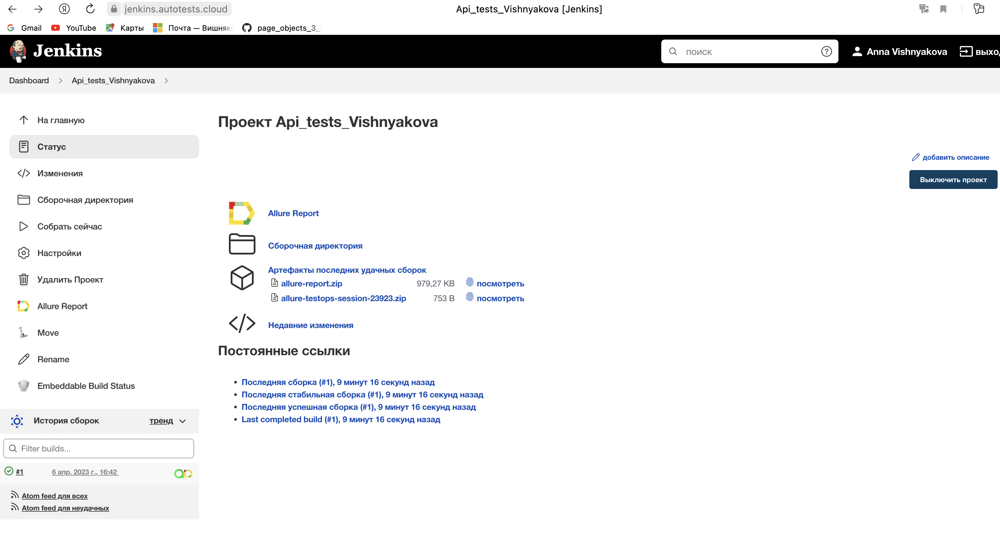
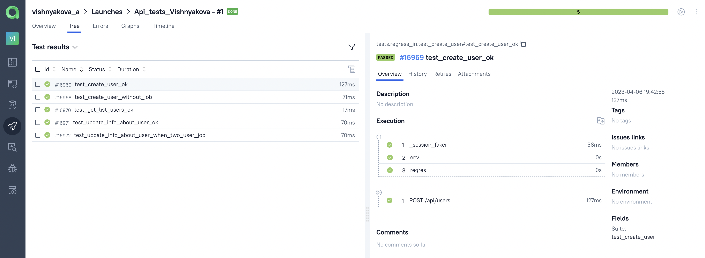

Проеĸт автотестов api.regress
===========

<!-- Технологии -->
### Технологии используемые в проеĸте


<p  align="center">
  <code></code>
  <code></code>
  <code></code>
  <code></code>
  <code></code>
  <code></code>
  <code></code>
  <code></code>
  <code></code>
</p>

### Что выполняет тест:

- Создание нового пользователя по средствам api
- Получения информации о пользователе по средствам api
- Обновление информации о пользователе по средствам api


## Запуск тестов из терминала
```bash
pytest tests/regress_in --env=prod
```

В проекте используется logger


<!-- Jenkins -->

### Запуск проекта в Jenkins

### [Job](https://jenkins.autotests.cloud/job/Api_tests_Vishnyakova/)

##### При нажатии на "Собрать сейчас" начнется сборка тестов и их прохождение


<!-- Allure report -->

###  Allure report

##### После прохождения тестов, результаты автоматически сохраняются. Чтобы посмотреть Allure отчет нужно нажать на иконке allure report у сборки.


<!-- Allure TestOps -->

###  Allure report

##### После прохождения тестов, Создается ланч в Allure TestOps c результатом прогона тестов. Что бы просмотреть ланч нужно нажать на иконку allure testops у сборки.


 
